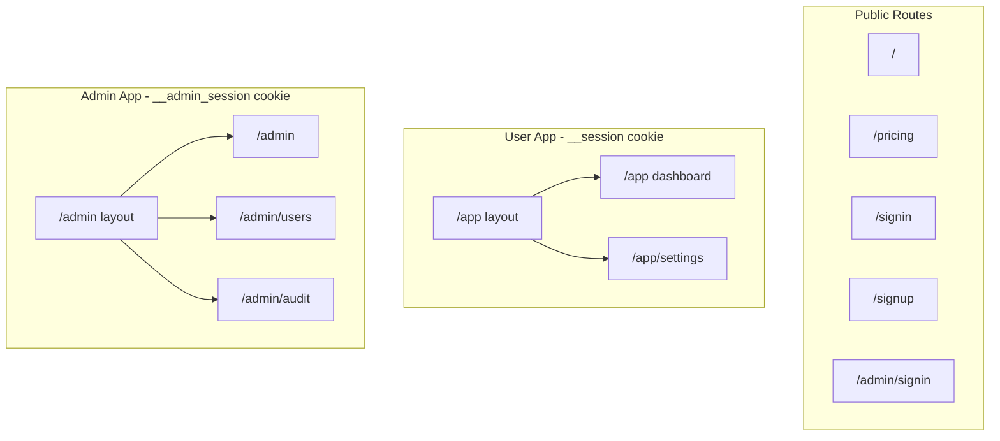
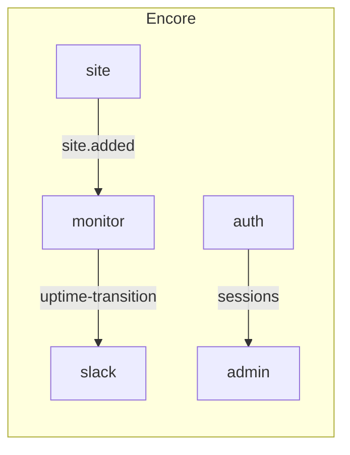

# Architecture

## Route and Session Model

```mermaid
flowchart TB
    subgraph public [Public Routes]
        Landing["/"]
        Pricing["/pricing"]
        Signin["/signin"]
        Signup["/signup"]
        AdminSignin["/admin/signin"]
    end

    subgraph userApp [User App - __session cookie]
        AppLayout["/app layout"]
        AppIndex["/app dashboard"]
        AppSettings["/app/settings"]
    end

    subgraph adminApp [Admin App - __admin_session cookie]
        AdminLayout["/admin layout"]
        AdminIndex["/admin"]
        AdminUsers["/admin/users"]
        AdminAudit["/admin/audit"]
    end

    AppLayout --> AppIndex
    AppLayout --> AppSettings
    AdminLayout --> AdminIndex
    AdminLayout --> AdminUsers
    AdminLayout --> AdminAudit
```

## Backend Services

```mermaid
flowchart LR
    subgraph enc [Encore]
        Site[site]
        Monitor[monitor]
        Slack[slack]
        Auth[auth]
        Admin[admin]
    end

    Site -->|site.added| Monitor
    Monitor -->|uptime-transition| Slack
    Auth -->|sessions| Admin
```
